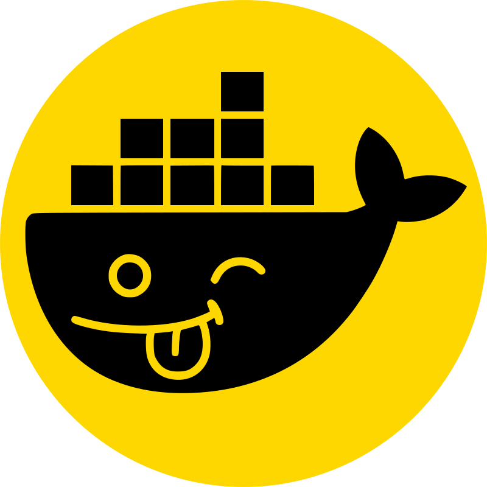

# Dumb Docker

<p align="center">
  
</p>

**Dumb Docker** is a lightweight dashboard for self-hosters.
It helps you see, organize, and control Docker containers running on your VPS.

## Why use it?

- 🐳 View all containers in one place
- 📦 Group containers by application/repository
- 🔗 Show GitHub repo link, branch, and commit for each app
- 🔄 Restart/stop containers quickly
- 📜 Read logs in the browser
- 📊 See per-application resource share

Great for personal servers, homelabs, and small production VPS deployments.

## Visual preview

Dumb Docker was designed to be friendly and practical: open the panel, see your apps, click to manage containers, done.


## Quick Start (Docker Compose)

### 1) Clone

```bash
git clone https://github.com/Bobagi/dumb-docker.git
cd dumb-docker
```

### 2) Create root `.env`

```bash
cat > .env <<EOF
FRONTEND_PORT=3000
BACKEND_PORT=8000
EOF
```

### 3) Configure login for dashboard

Create `frontend/.env` (or copy from `frontend/.env.example`):

```bash
cp frontend/.env.example frontend/.env
```

Set at least:

- `NEXTAUTH_SECRET`
- `ADMIN_USERNAME`
- `ADMIN_PASSWORD` **or** `ADMIN_PASSWORD_SHA256`

### 4) Start

```bash
docker compose up --build
```

Open: `http://YOUR_SERVER_IP:3000`

## Daily commands

### Restart stack

```bash
docker compose down
docker compose up --build -d
```

### See logs

```bash
docker compose logs -f
```

### Update after pulling new code

```bash
git pull
docker compose down
docker compose up --build -d
```

## Application-aware scan

The backend scans these paths by default:

- `/opt`
- `/srv`
- `/var/www`

An app is detected when a folder has at least one of:

- `.git`
- `docker-compose.yml` / `docker-compose.yaml` / `compose.yml` / `compose.yaml`
- `Dockerfile`

`docker-compose.yml` already mounts these host paths read-only into the backend container so discovery works on VPS.

### Domain/subdomain detection (Nginx)

The backend also scans `/etc/nginx` (mounted read-only) and tries to map `server_name` entries to each detected application by:

- matching `root`/`alias` paths that are inside the repository path;
- matching `proxy_pass` host ports against the app's published Docker ports.

Matching is done **per `server { ... }` block** (not across the whole file), to avoid leaking domains from unrelated virtual hosts in the same config file.

When a match is found, the app card shows one or more 🌐 buttons that open the detected domain in a new tab. Hovering the button shows the config source file and match strategy.

### Scanner config

`backend/config.yml`:

```yaml
applications:
  scanPaths:
    - /opt
    - /srv
    - /var/www
  scanIntervalSeconds: 60
```

You can override with env vars:

- `APPLICATION_SCAN_PATHS` (comma-separated)
- `APPLICATION_SCAN_INTERVAL_SECONDS`

## API endpoints

Existing container endpoints remain available.

New endpoints:

- `GET /api/applications`
- `GET /api/applications/:id`
- `GET /api/applications/:id/git-status`

## Notes

- This project is optimized for practical VPS usage.
- If you run from Docker Compose, rebuild on backend changes to ensure dependencies/tools (like `git`) are present inside the backend container.
